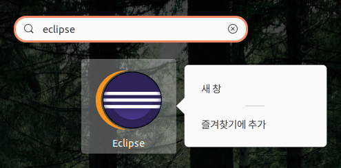
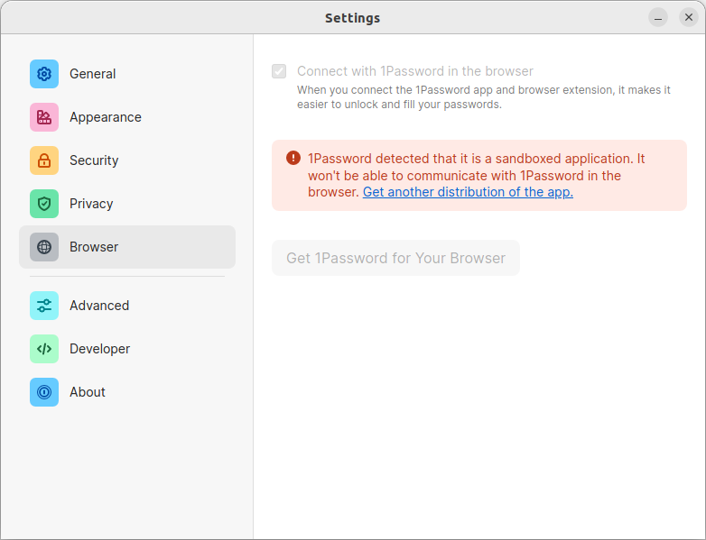
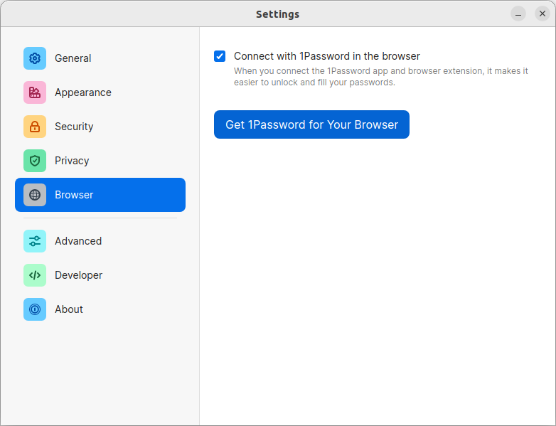

# Ubuntu Desktop

- [Ubuntu Desktop](#ubuntu-desktop)
  - [root 비밀번호 설정](#root-비밀번호-설정)
  - [Nautilus](#nautilus)
  - [locale은 한국으로 유지한 채 홈 디렉토리 명만 영어로 바꾸기](#locale은-한국으로-유지한-채-홈-디렉토리-명만-영어로-바꾸기)
    - [English 설치 후 Korean 설정 추가](#english-설치-후-korean-설정-추가)
  - [그래픽 카드 드라이버](#그래픽-카드-드라이버)
  - [Background](#background)
  - [Terminal](#terminal)
    - [투명도 설정](#투명도-설정)
  - [Tools](#tools)
  - [Oh My Zsh](#oh-my-zsh)
  - [GitHub SSH Key 등록](#github-ssh-key-등록)
  - [SDK Manager](#sdk-manager)
  - [GNOME Shell Extensions](#gnome-shell-extensions)
    - [dash-to-dock](#dash-to-dock)
  - [Ubuntu login loop](#ubuntu-login-loop)
  - [Package Manager](#package-manager)
  - [Visual Studio Code](#visual-studio-code)
  - [Docker](#docker)
    - [자동 설치](#자동-설치)
    - [수동 설치](#수동-설치)
    - [특정 버전 설치](#특정-버전-설치)
  - [Virtual Box](#virtual-box)
  - [Vagrant](#vagrant)
  - [JetBrains Toolbox](#jetbrains-toolbox)
  - [Eclipse](#eclipse)
  - [1Password](#1password)
    - [snap](#snap)
    - [deb](#deb)
  - [NordVPN 설치](#nordvpn-설치)
  - [Dropbox](#dropbox)
    - [Dropbox Headless](#dropbox-headless)
    - [Usages](#usages)
  - [Cursor AI](#cursor-ai)

```bash
cat /etc/debian_version
# bullseye/sid
```

## root 비밀번호 설정

```sh
sudo -i
```

```sh
root> passwd
# New password: 
# Retype new password: 
# passwd: password updated successfully
```

## Nautilus

- Ubuntu의 기본 파일 관리자
- 가끔 GNOME UI 세팅하다보면 사라질 때가 있는데(...) 다시 설치해주면 된다.

```sh
sudo apt-get install nautilus
```

## locale은 한국으로 유지한 채 홈 디렉토리 명만 영어로 바꾸기

```bash
export LANG=C; xdg-user-dirs-gtk-update

ls $HOME
# Desktop  Documents  Downloads  Music  Pictures  Public  Templates  Videos

cat ~/.config/user-dirs.locale
# C
cat ~/.config/user-dirs.dirs
# XDG_DESKTOP_DIR="$HOME/Desktop"
# XDG_DOWNLOAD_DIR="$HOME/Downloads"
# XDG_TEMPLATES_DIR="$HOME/Templates"
# XDG_PUBLICSHARE_DIR="$HOME/Public"
# XDG_DOCUMENTS_DIR="$HOME/Documents"
# XDG_MUSIC_DIR="$HOME/Music"
# XDG_PICTURES_DIR="$HOME/Pictures"
# XDG_VIDEOS_DIR="$HOME/Videos"
```

```bash
# 다시 한국어로 바꾸고 'Keep old folders'
export LANG=ko_KR.utf8; xdg-user-dirs-gtk-update

locale
# LANG=ko_KR.UTF-8
# LANGUAGE=
# LC_CTYPE="ko_KR.UTF-8"
# LC_NUMERIC="ko_KR.UTF-8"
# LC_TIME="ko_KR.UTF-8"
# LC_COLLATE="ko_KR.UTF-8"
# LC_MONETARY="ko_KR.UTF-8"
# LC_MESSAGES="ko_KR.UTF-8"
# LC_PAPER="ko_KR.UTF-8"
# LC_NAME="ko_KR.UTF-8"
# LC_ADDRESS="ko_KR.UTF-8"
# LC_TELEPHONE="ko_KR.UTF-8"
# LC_MEASUREMENT="ko_KR.UTF-8"
# LC_IDENTIFICATION="ko_KR.UTF-8"
# LC_ALL=
```

### English 설치 후 Korean 설정 추가

- [참고](https://osg.kr/archives/913)

> Language Support > Install/Remove Languages > Korean

Applying changes

> Region & Language > Input sources

- [x] Korean (Hangul)
- [ ] Korean
- [ ] Korean (101/104 key compatible)

```sh
ibus-setup-hangul
```

- [x] Start in Hangul mode

## 그래픽 카드 드라이버

```bash
nvidia-detector
# nvidia-driver-460
sudo lshw -C display
# *-display
```

```bash
sudo apt install -y nvidia-driver-460
sudo apt install -y nvidia-utils-460
reboot
```

```bash
watch -d -n 1 nvidia-smi

+-----------------------------------------------------------------------------+
| NVIDIA-SMI 460.32.03    Driver Version: 460.32.03    CUDA Version: 11.2     |
|-------------------------------+----------------------+----------------------+
| GPU  Name        Persistence-M| Bus-Id        Disp.A | Volatile Uncorr. ECC |
| Fan  Temp  Perf  Pwr:Usage/Cap|         Memory-Usage | GPU-Util  Compute M. |
|                               |                      |               MIG M. |
|===============================+======================+======================|
|   0  GeForce GTX 1660    Off  | 00000000:09:00.0  On |                  N/A |
| 46%   31C    P8     8W / 130W |    215MiB /  5936MiB |      3%      Default |
|                               |                      |                  N/A |
+-------------------------------+----------------------+----------------------+

+-----------------------------------------------------------------------------+
| Processes:                                                                  |
|  GPU   GI   CI        PID   Type   Process name                  GPU Memory |
|        ID   ID                                                   Usage      |
|=============================================================================|
|    0   N/A  N/A       999      G   /usr/lib/xorg/Xorg                 53MiB |
|    0   N/A  N/A      2178      G   /usr/lib/xorg/Xorg                 96MiB |
|    0   N/A  N/A      2477      G   /usr/bin/gnome-shell               54MiB |
+-----------------------------------------------------------------------------+
```

## Background

- [Unsplash](https://unsplash.com/photos/k5Vj3gx4vHE)

## Terminal

### 투명도 설정


## Tools

```sh
sudo apt-get install -y git vim tmux bash bash-completion
sudo snap install curl
```

```sh
git config --global user.email "imcxsu@gmail.com"
git config --global user.name "Changsu Im"
git config --global core.editor vim
```

## Oh My Zsh

- [ohmyzsh/ohmyzsh](https://github.com/ohmyzsh/ohmyzsh)

```bash
sudo apt-get install zsh
sh -c "$(curl -fsSL https://raw.githubusercontent.com/ohmyzsh/ohmyzsh/master/tools/install.sh)"

# $HOME/.zshrc
ZSH_THEME="gozilla"

source $HOME/.zshrc

cat /etc/shells
# /bin/sh
# /bin/bash
# /usr/bin/bash
# /bin/rbash
# /usr/bin/rbash
# /bin/dash
# /usr/bin/dash
# /usr/bin/tmux
# /usr/bin/fish
# /bin/zsh
# /usr/bin/zsh

chsh -s /usr/bin/zsh
reboot # 리부팅해야 적용된다.
```

root 계정만 `fish`를 사용하고 일반 사용자 계정은 `bash`를 사용할 수도 있다.

```bash
echo $SHELL
# /bin/bash
# chsh --shell /usr/bin/fish

grep $USER /etc/passwd
# markruler:x:1000:1000:markruler,,,:/home/markruler:/usr/bin/fish

sudo usermod --shell /bin/bash $USER
grep $USER /etc/passwd
# markruler:x:1000:1000:markruler,,,:/home/markruler:/bin/bash

reboot
```

## GitHub SSH Key 등록

```sh
ssh-keygen -t ed25519 -f $HOME/.ssh/github_ed25519 -C "comment" -N ""
```

- [GitHub - SSH and GPG keys](https://github.com/settings/keys)
  - Authentication Keys에 public key 추가

```sh
# ~/.ssh/config
Host github.com
  IdentityFile ~/.ssh/github_ed25519
  User git

Host bitbucket.org
  IdentityFile ~/.ssh/bitbucket_ed25519
  User git

Host tost
  HostName 192.168.0.219
    HostKeyAlgorithms=+ssh-rsa,ssh-dss
    Port=22
    User markruler
    LogLevel VERBOSE
```

## SDK Manager

- [sdkman](https://sdkman.io/)

```bash
curl -s "https://get.sdkman.io" | bash
source "$HOME/.sdkman/bin/sdkman-init.sh"
```

```bash
sdk version
> SDKMAN 5.11.2+698
```

```bash
sdk list
# [gradle, maven, java, ...]

# sdk list [package]
sdk install maven 3.6.3
sdk install gradle 6.8.3

sdk list java
sdk install java 11.0.11.hs-adpt
java --version

sdk install java 8.0.292.hs-adpt
java -version
```

## GNOME Shell Extensions

- [GNOME에 도움되는 확장 기능](https://extensions.gnome.org/)

### dash-to-dock

- [options](https://github.com/micheleg/dash-to-dock/blob/master/schemas/org.gnome.shell.extensions.dash-to-dock.gschema.xml)

```sh
gsettings set org.gnome.shell.extensions.dash-to-dock animation-time 0.2
gsettings set org.gnome.shell.extensions.dash-to-dock autohide true
gsettings set org.gnome.shell.extensions.dash-to-dock autohide-in-fullscreen true
gsettings set org.gnome.shell.extensions.dash-to-dock background-opacity 0.6 # 배경 투명도
gsettings set org.gnome.shell.extensions.dash-to-dock dash-max-icon-size 48 # 범위: 16-64 (FHD: 32, QHD: 48, 4K: 64 추천)
gsettings set org.gnome.shell.extensions.dash-to-dock dock-fixed false
gsettings set org.gnome.shell.extensions.dash-to-dock dock-position BOTTOM
gsettings set org.gnome.shell.extensions.dash-to-dock extend-height false # 화면에 아이콘이 꽉 차지 않을 때 여백을 두지 않음
gsettings set org.gnome.shell.extensions.dash-to-dock force-straight-corner false
gsettings set org.gnome.shell.extensions.dash-to-dock hotkeys-show-dock true
gsettings set org.gnome.shell.extensions.dash-to-dock intellihide-mode FOCUS_APPLICATION_WINDOWS
gsettings set org.gnome.shell.extensions.dash-to-dock multi-monitor true # 모니터가 여러 개일 때 어느 모니터에서든 dock을 볼 수 있음
gsettings set org.gnome.shell.extensions.dash-to-dock scroll-action cycle-windows # 아이콘 위에서 마우스 스크롤하면 여러 윈도우를 이동할 수 있음
gsettings set org.gnome.shell.extensions.dash-to-dock show-favorites true
gsettings set org.gnome.shell.extensions.dash-to-dock show-mounts true
gsettings set org.gnome.shell.extensions.dash-to-dock show-trash true
gsettings set org.gnome.shell.extensions.dash-to-dock show-windows-preview true
gsettings set org.gnome.shell.extensions.dash-to-dock transparency-mode FIXED # 투명도 모드
gsettings set org.gnome.shell.extensions.dash-to-dock running-indicator-style DASHES # 실행 중인 앱 표시 형태
```

dock을 자동으로 숨기고 싶다면 아래 설정을 적용한다.

```sh
gsettings set org.gnome.shell.extensions.dash-to-dock dock-fixed false
gsettings set org.gnome.shell.extensions.dash-to-dock autohide true
gsettings set org.gnome.shell.extensions.dash-to-dock autohide-in-fullscreen true
gsettings set org.gnome.shell.extensions.dash-to-dock intellihide true
```

반대로 고정하고 싶다면 아래 설정을 적용한다.

```sh
gsettings set org.gnome.shell.extensions.dash-to-dock dock-fixed true
gsettings set org.gnome.shell.extensions.dash-to-dock autohide false
gsettings set org.gnome.shell.extensions.dash-to-dock autohide-in-fullscreen false
gsettings set org.gnome.shell.extensions.dash-to-dock intellihide false
```

hot-key가 비활성화 상태라면 바꾼다.

```sh
gsettings set org.gnome.shell.extensions.dash-to-dock hot-keys true # `super`+`num`
gsettings list-recursively org.gnome.shell.extensions.dash-to-dock | grep app-hotkey
# org.gnome.shell.extensions.dash-to-dock app-hotkey-1 ['<Super>2']
# org.gnome.shell.extensions.dash-to-dock app-hotkey-10 ['<Super>0']
# org.gnome.shell.extensions.dash-to-dock app-hotkey-2 ['<Super>2']
# org.gnome.shell.extensions.dash-to-dock app-hotkey-3 ['<Super>3']
# org.gnome.shell.extensions.dash-to-dock app-hotkey-4 ['<Super>4']
# org.gnome.shell.extensions.dash-to-dock app-hotkey-5 ['<Super>5']
# org.gnome.shell.extensions.dash-to-dock app-hotkey-6 ['<Super>6']
# org.gnome.shell.extensions.dash-to-dock app-hotkey-7 ['<Super>7']
# org.gnome.shell.extensions.dash-to-dock app-hotkey-8 ['<Super>8']
# org.gnome.shell.extensions.dash-to-dock app-hotkey-9 ['<Super>9']
```

초기화하기 위해서는 아래 명령어를 사용한다.

```bash
dconf reset -f /org/gnome/shell/extensions/dash-to-dock/
```


dock에 있는 앱들을 `Super`+`숫자` 조합으로 선택할 수 있다.

## Ubuntu login loop

위와 같이 `gsettings`를 수정하면 부팅 시 계정을 생성하는 페이지만 나오는 경우가 있다.
GDM3나 그래픽 드라이버 문제일 수 있다.

- [참조: 스택오버플로우](https://askubuntu.com/questions/1277793/ubuntu-20-04-always-forces-me-to-create-a-new-user-at-boot/)
- 우선 계정 생성 페이지에서는 터미널을 열 수 없기 때문에 `Ctrl`+`Alt`+`t`
- 다른 가상 터미널(Virtual Terminal)에 접근한다. `Ctrl`+`Alt`+`f1-f6` or `Alt`+`left|right`

```bash
sudo vi /etc/xdg/autostart/gnome-initial-setup-first-login.desktop
# 아래와 같은 라인을 주석 처리한다.
Exec=/usr/libexec/gnome-initial-setup --existing-user
```

확실히 하기 위해 패키지까지 제거한 후 gdm3 구성 정보를 추가한다.

```bash
sudo apt remove gnome-initial-setup
```

```bash
vi /etc/gdm3/custom.conf

# [daemon]
# InitialSetupEnable=False
```

## Package Manager

- [snapcraft](https://snapcraft.io/install/snapcraft/ubuntu)

```sh
sudo apt update
sudo apt install snapd

## snapcraft 설치
sudo snap install snapcraft --classic
```

```sh
# telegram
sudo snap find telegram
sudo snap install telegram-desktop

# Slack
sudo snap install slack --classic

# Discord
sudo snap install discord

# Postman
sudo snap install postman
```

## Visual Studio Code

```sh
# sudo snap install code --classic
# sudo snap remove code
```

snap으로 설치할 경우 한글이 입력되지 않는다.
`.deb` 패키지를 다운로드 받아서 설치한다.

- [Download Visual Studio Code](https://code.visualstudio.com/download)

```sh
mv ~/Downloads/code_${VERSION}_amd64.deb /tmp
cd /tmp
sudo dpkg -i code_${VERSION}_amd64.deb
```

## Docker

### 자동 설치

```sh
sudo apt-get remove docker docker-engine docker.io
sudo apt-get update
sudo apt install docker.io
```

### 수동 설치

```sh
# Update the apt package index and install packages to allow apt to use a repository over HTTPS
sudo apt-get update
sudo apt-get install \
    ca-certificates \
    curl \
    gnupg \
    lsb-release

# Add Docker’s official GPG key
sudo mkdir -p /etc/apt/keyrings
curl -fsSL https://download.docker.com/linux/ubuntu/gpg | sudo gpg --dearmor -o /etc/apt/keyrings/docker.gpg

# set up the repository
echo \
  "deb [arch=$(dpkg --print-architecture) signed-by=/etc/apt/keyrings/docker.gpg] https://download.docker.com/linux/ubuntu \
  $(lsb_release -cs) stable" | sudo tee /etc/apt/sources.list.d/docker.list > /dev/null

# Install Docker Engine
sudo apt-get update
sudo apt-get install docker-ce docker-ce-cli containerd.io docker-compose-plugin
```

### 특정 버전 설치

```sh
# List the versions available in your repo
apt-cache madison docker-ce

# Install a specific version using the version string from the second column, for example, 5:20.10.16~3-0~ubuntu-jammy
sudo apt-get install \
  docker-ce=5:20.10.17~3-0~ubuntu-jammy \
  docker-ce-cli=5:20.10.17~3-0~ubuntu-jammy \
  containerd.io \
  docker-compose-plugin
```

## Virtual Box

VM Provider

```sh
sudo apt install -y virtualbox
```

## Vagrant

VM provisioning tool

- [다운로드](https://www.vagrantup.com/downloads)

```sh
cd /tmp
wget -O- https://apt.releases.hashicorp.com/gpg | gpg --dearmor | sudo tee /usr/share/keyrings/hashicorp-archive-keyring.gpg
echo "deb [signed-by=/usr/share/keyrings/hashicorp-archive-keyring.gpg] https://apt.releases.hashicorp.com $(lsb_release -cs) main" | sudo tee /etc/apt/sources.list.d/hashicorp.list
sudo apt update
sudo apt install vagrant
vagrant --version
```

## JetBrains Toolbox

- [Download](https://www.jetbrains.com/toolbox-app/)

```bash
tar xf jetbrains-toolbox-1.21.9712.tar.gz
cd jetbrains-toolbox-1.21.9712

./jetbrains-toolbox
```

```sh
# dlopen(): error loading libfuse.so.2
# AppImages require FUSE to run. 
# You might still be able to extract the contents of this AppImage 
# if you run it with the --appimage-extract option. 
# See https://github.com/AppImage/AppImageKit/wiki/FUSE 
# for more information

# 만약 위와 같은 에러가 발생한다면 아래 명령어를 실행한다.
sudo apt-get install libfuse2
```

## Eclipse

IntelliJ는 Toolbox로 쉽게 관리할 수 있지만, Eclipse는 번거로운 작업이 있다.

- [버전 요구 사항](https://wiki.eclipse.org/Eclipse/Installation)
  - [Eclipse 4.6 (Neon)](https://www.eclipse.org/downloads/packages/release/neon)부터 Java 8 이상 필수
  - [Eclipse 4.16 (2020-06)](https://www.eclipse.org/downloads/packages/release/2020-06/r)
  - [Eclipse 4.17 (2020-09)](https://www.eclipse.org/downloads/packages/release/2020-09/r)부터 Java 11 이상 필수

```bash
cp eclipse-jee-2020-06-R-linux-gtk-x86_64.tar.gz /tmp

cd /tmp
tar xvf eclipse-jee-2020-06-R-linux-gtk-x86_64.tar.gz -C $HOME

cd ~/eclipse
./eclipse
```

```bash
vi /usr/share/applications/eclipse.desktop
```

```properties
[Desktop Entry]
Type=Application
Name=Eclipse
Comment=Eclipse Integrated Development Environment
Icon=/home/markruler/eclipse/icon.xpm
Exec=/home/markruler/eclipse/eclipse
Terminal=false
Categories=Development;IDE;Java;
```

```ini
; vi ~/eclipse/eclipse.ini
; 꼭 vmargs 앞에 vm이 와야 한다.

-vm
/home/markruler/.sdkman/candidates/java/current/jre/bin/java
-vmargs
-Dosgi.requiredJavaVersion=1.8
-Dosgi.instance.area.default=@user.home/eclipse-workspace
```



'즐겨찾기에 추가'하면 dock에 추가된다.

## 1Password

### snap

snap으로 설치하면 브라우저와 앱을 연결할 수 없다.

```sh
# sudo snap install 1password
```



### deb

```sh
# https://1password.com/downloads/linux/
sudo dpkg -i 1password-latest.deb
```

```sh
# 에러 발생 시
sudo apt --fix-broken install
```



## NordVPN 설치

- [매뉴얼](https://support.nordvpn.com/Connectivity/Linux/1325531132/Installing-and-using-NordVPN-on-Debian-Ubuntu-Elementary-OS-and-Linux-Mint.htm)

```bash
cd /tmp
curl -LSf https://downloads.nordcdn.com/apps/linux/install.sh -o nordvpn.sh
chmod +x nordvpn.sh
./nordvpn.sh

# ...
# NordVPN for Linux successfully installed!
# To get started, please re-login or execute `su - $USER` in the current shell, type 'nordvpn login' and enter your NordVPN account details. Then type 'nordvpn connect' and you’re all set! To allow other users to use the application run 'usermod -aG nordvpn otheruser'. If you need help using the app, use the command 'nordvpn --help'.
```

```bash
sudo nordvpn help

sudo nordvpn login
# sudo nordvpn logout
sudo nordvpn countries
sudo nordvpn cities united_states

sudo nordvpn c # connect
sudo nordvpn c us # united_states
sudo nordvpn d # disconnect

sudo nordvpn set technology # Set connection technology (OpenVPN or NordLynx)
sudo nordvpn set protocol udp # [tcp, udp]
sudo nordvpn set killswitch on
sudo nordvpn set cybersec on
sudo nordvpn set notify on
sudo nordvpn set obfuscate on
sudo nordvpn set autoconnect on
sudo nordvpn settings

sudo nordvpn status
sudo nordvpn rate # Rate your last connection quality (1-5)
```

## Dropbox

- [Download](https://www.dropbox.com/install-linux)

```sh
# Ubuntu 18.04 ~ 22.04
sudo dpkg -i dropbox_2020.03.04_amd64.deb
# Ubuntu 22.10+
sudo dpkg -i dropbox_2024.04.17_amd64.deb
```

### Dropbox Headless

```sh
cd ~ && wget -O - "https://www.dropbox.com/download?plat=lnx.x86_64" | tar xzf -
~/.dropbox-dist/dropboxd
```

```sh
dropbox filestatus ~/Dropbox
```

### Usages

```sh
dropbox status
dropbox start
dropbox autostart y
# dropbox stop
dropbox filestatus ~/Dropbox
dropbox exclude list
dropbox exclude add ebook
```

## Cursor AI

- [simple](https://gist.github.com/evgenyneu/5c5c37ca68886bf1bea38026f60603b6)
- [script](https://gist.github.com/Kinyugo/9845e18998744ff54b8f0cde3bb37182)

```sh
curl https://gist.githubusercontent.com/Kinyugo/9845e18998744ff54b8f0cde3bb37182/raw/a9425582958c14f80acea08e51c49b1bf63840c7/install_cursor.sh | sh
```

```sh
cursor
```
