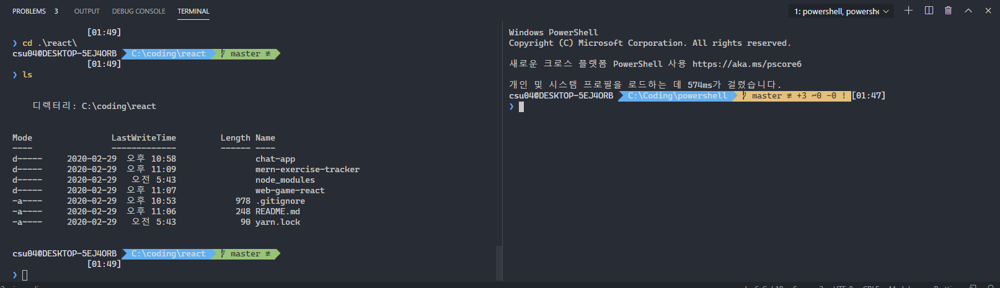

# PowerShell Prompt Customization and Git Setup Guide

> 튜토리얼 강의들을 보면 터미널에 화살표가 들어가서 라인 구분하기가 좋아보이길래 (멋잇어 보이길래) 찾아봤다.




- [```Windows Terminal```](#Windows-Terminal)
- [```Chocolatey```](#Chocolatey)
- [```posh-git```](#posh-git)
- [```oh-my-posh```](#oh-my-posh)

## [Windows Terminal](https://www.microsoft.com/en-us/p/windows-terminal-preview/9n0dx20hk701)

- set a profiles.json
- run as a Administrator [(by default)](http://nuts4.net/post/windows-terminal-run-as-admin)

```PowerShell
# not working
# C:\Windows\system32\cmd.exe /c start /b wt
```

## [Chocolatey](https://github.com/chocolatey/choco)

- a Windows package manager\

```PowerShell
# (in PowerShell as Administrator)
Set-ExecutionPolicy Bypass -Scope Process -Force; iex ((New-Object System.Net.WebClient).DownloadString('https://chocolatey.org/install.ps1'))
```

[ConEmu](https://conemu.github.io/)

```PowerShell
choco install ConEmu
```

## [posh-git](https://github.com/dahlbyk/posh-git)

- a PowerShell module that integrates Git and PowerShell by providing Git status summary information that can be displayed in the PowerShell prompt, e.g.

```PowerShell
Install-Module posh-git -Scope CurrentUser
```

## [oh-my-posh](https://github.com/JanDeDobbeleer/oh-my-posh?WT.mc_id=-blog-scottha)

```ps
Install-Module oh-my-posh -Scope CurrentUser
```

### automatically applied every time it starts

```ps
Install-Module -Name PSReadLine -AllowPrerelease -Scope CurrentUser -Force -SkipPublisherCheck

if (!(Test-Path -Path $PROFILE )) { New-Item -Type File -Path $PROFILE -Force }
notepad $PROFILE

# 위를 입력하면 Microsoft.PowerShell_profile.ps1 파일 생성되어 열린다.

# (vs code가 있다면 code $PROFILE)

# 경로는 $PROFILE 입력하면 나옴

# 해당 파일에 아래의 명령어들 입력-저장

Import-Module posh-git
Import-Module oh-my-posh
Set-Theme paradox
```

### to set a font ([Nerd Fonts](https://www.nerdfonts.com/))

```ps
$ThemeSettings
$ThemeSettings.GitSymbols.BranchSymbol = [char]::ConvertFromUtf32(0xE0A0)
```

### in Windows terminal app

- [Install a compatible Font for the terminal.](https://www.nerdfonts.com/)

```ps
# Inside of the Windows Terminal, go to Settings and add the fontFace line to your profile.json under the Ubuntu and PowerShell section.
# 경로 모르면 그냥 terminal app 에서 settings
"fontFace": "Delugia Nerd Font"
```

### in VS Code

```ps
# setting.json
"terminal.integrated.fontFamily": "Delugia Nerd Font"
```

### Git

```bash
$GitPromptSettings
$DefaultUser = 'yourUsernameHere'
```

### reference

1. [oh-my-posh](https://github.com/JanDeDobbeleer/oh-my-posh?WT.mc_id=-blog-scottha)
1. [How to make a pretty prompt in Windows Terminal with Powerline, Nerd Fonts, Cascadia Code, WSL, and oh-my-posh](https://www.hanselman.com/blog/HowToMakeAPrettyPromptInWindowsTerminalWithPowerlineNerdFontsCascadiaCodeWSLAndOhmyposh.aspx)